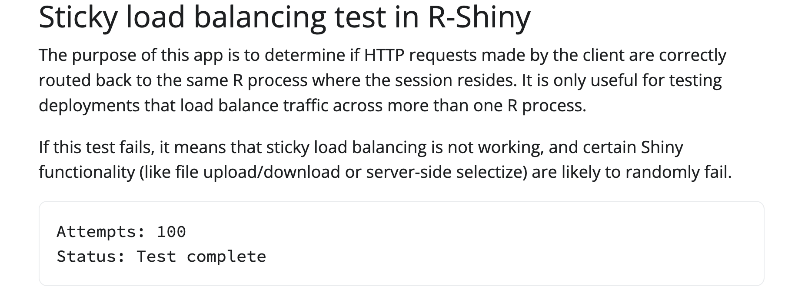

# Load Balancing Shiny App

Original source: <https://github.com/rstudio/py-shiny/blob/7ba8f90a44ee25f41aa8c258eceeba6807e0017a/examples/load_balance/app.py>

Examples explained: <https://github.com/analythium/shiny-load-balancing>



| Flavour           | Link  | Image  |
|-------------------|---|---|
| Python Shiny      | [`py-shiny`](./py-shiny/)  | [`ghcr.io/h10y/lbtest/py-shiny`](https://github.com/h10y/lbtest/pkgs/container/lbtest%2Fpy-shiny)  |
| R Shiny           | [`r-shiny`](./r-shiny/)  | [`ghcr.io/h10y/lbtest/r-shiny`](https://github.com/h10y/lbtest/pkgs/container/lbtest%2Fr-shiny)  |
| Python Shinylive  | [`py-shinylive`](./py-shinylive/)  | [`ghcr.io/h10y/lbtest/py-shinylive`](https://github.com/h10y/lbtest/pkgs/container/lbtest%2Fpy-shinylive)  |
| R Shinylive       | [`r-shinylive`](./r-shinylive/)  | [`ghcr.io/h10y/lbtest/r-shinylive`](https://github.com/h10y/lbtest/pkgs/container/lbtest%2Fr-shinylive)  |

## Python Shinylive

Create Python Shinylive version following <https://github.com/posit-dev/py-shinylive>:

```bash
# Export static files
shinylive export py-shiny/app py-shinylive

# Serve contents, visit http://localhost:8080
python3 -m http.server --directory py-shinylive 8080
```

## R Shinylive

Create R Shinylive version following <https://github.com/posit-dev/r-shinylive/>:

```bash
# Export static files
R -q -e "shinylive::export('r-shiny/app', 'r-shinylive')"

# Serve contents, visit http://localhost:8080
R -q -e "httpuv::runStaticServer('r-shinylive', port=8080)"
```

## Serving Shinylive on GitHub Pages

Serving Shinylive apps on GitHub Pages (from `docs` folder on the `main` branch).

```bash
# Cleanup
rm -rf docs/py-shinylive docs/r-shinylive

# Copy files
cp -r r-shinylive docs/ && cp -r py-shinylive docs/

# Render HTML from markdown
pandoc -s -f markdown -t html5 -o "docs/index.html" "index.md"
```

See deployed Shinylive results at <https://h10y.github.io/lbtest/>.
